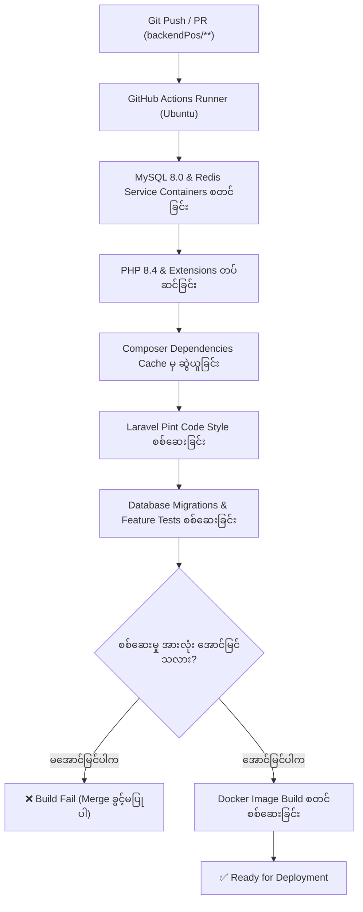

# အဆင့် (၂) - Backend CI/CD Pipeline တည်ဆောက်ခြင်း ရှင်းလင်းချက်

ဤမှတ်တမ်းသည် Restaurant POS စနစ်၏ Backend (`backendPos`) အတွက် **GitHub Actions** ကို အသုံးပြု၍ အလိုအလျောက် စစ်ဆေးခြင်း (Continuous Integration - CI) နှင့် Docker Image တည်ဆောက်ခြင်း (Continuous Deployment - CD) တို့ကို မည်သို့ ရေးဆွဲထားသည်နှင့် အဘယ်ကြောင့် ဤနည်းလမ်းများကို အသုံးပြုရသနည်းဆိုသည့် အချက်များကို မြန်မာဘာသာဖြင့် အသေးစိတ် ရှင်းလင်းထားပါသည်။

---

## ၁။ Backend CI/CD Pipeline ဖွဲ့စည်းပုံ ခြုံငုံသုံးသပ်ချက်

ဖိုင်လမ်းကြောင်း: `.github/workflows/backend-ci-cd.yml`

Developer တစ်ဦးသည် Code အသစ်များကို Git ပေါ်သို့ `git push` လုပ်လိုက်သည့်အခါ သို့မဟုတ် `main` / `develop` branch သို့ Pull Request (PR) တင်သည့်အခါ အောက်ပါအဆင့်များကို အလိုအလျောက် စစ်ဆေးပေးပါသည် -

---

## ၂။ အဆင့်ဆင့် လုပ်ဆောင်ပုံများ (Step-by-Step Breakdown)

### အဆင့် (၁) - Trigger Conditions သတ်မှတ်ခြင်း
- `backendPos/**`, `docker/**` သို့မဟုတ် workflow ဖိုင် ပြောင်းလဲမှသာ ဤ pipeline ကို run စေပါသည်။
- Frontend သီးသန့် ပြောင်းလဲမှုများကြောင့် Backend pipeline မလိုလားအပ်ဘဲ အချိန်ကုန်ခံ run နေခြင်းကို ကာကွယ်ပေးပါသည်။

### အဆင့် (၂) - Test & Lint Job စတင်ခြင်း
1. **Service Containers (MySQL 8.0 & Redis)**:
   - Pipeline အတွင်း သီးသန့် MySQL နှင့် Redis container များကို Background တွင် ဖွင့်လှစ်ပေးပါသည်။
   - Healthcheck စနစ် ထည့်သွင်းထားသောကြောင့် DB နှင့် Redis အဆင်သင့်ဖြစ်မှသာ Test စတင်ပါသည်။
2. **PHP 8.4 Setup**:
   - Production တွင် အသုံးပြုမည့် PHP 8.4 ဗားရှင်းနှင့် `mbstring`, `pdo_mysql`, `bcmath`, `redis`, `opcache` extension များကို တပ်ဆင်ပါသည်။
3. **Composer Cache**:
   - `composer.lock` hash ကို အခြေခံ၍ vendor package များကို cache လုပ်ထားသောကြောင့် နောက်တစ်ကြိမ် run လျှင် စက္ကန့်ပိုင်းအတွင်း ပြီးစီးပါသည်။
4. **Laravel Pint Linting**:
   - `./vendor/bin/pint --test` ဖြင့် ကုဒ်ဖွဲ့စည်းပုံ စံချိန်စံညွှန်း မညီညွတ်ပါက build ကို ရပ်တန့်စေပါသည်။
5. **Automated Testing**:
   - `php artisan test` ဖြင့် စားသောက်ဆိုင် POS ၏ Database migration များနှင့် Unit/Feature test များကို အမှန်တကယ် စစ်ဆေးပါသည်။

### အဆင့် (၃) - Docker Build Job
- Test အားလုံး အောင်မြင်မှသာ `build-docker` job ကို ဆက်လက်လုပ်ဆောင်ပါသည်။
- `docker/php/Dockerfile` ကို အခြေခံ၍ Production-ready Docker Image တည်ဆောက်ပြီး syntax သို့မဟုတ် build error များ ရှိ/မရှိ စစ်ဆေးပါသည်။

---

## ၃။ အဘယ်ကြောင့် ဤ Feature များကို အသုံးပြုရသနည်း (Why Use Each Feature)

### (၁) အဘယ်ကြောင့် GitHub Actions ကို ရွေးချယ်သနည်း။
- GitHub Repository နှင့် တိုက်ရိုက်ပေါင်းစပ်ထားသောကြောင့် ပြင်ပ server မလိုခြင်း။
- Developer များ Pull Request တင်သည့်အခါ Code မစစ်ရသေးဘဲ Merge လုပ်မိခြင်းမှ အလိုအလျောက် ကာကွယ်ပေးနိုင်ခြင်း။

### (၂) အဘယ်ကြောင့် MySQL နှင့် Redis Service Container များကို အစစ်ထည့်သွင်း စမ်းသပ်သနည်း။
- အချို့သော CI များတွင် SQLite သာ သုံးလေ့ရှိသော်လည်း Restaurant POS တွင် **MySQL သီးသန့် Query များ**၊ Foreign Key Constraints များနှင့် **Redis In-Memory Cache** (ဥပမာ: Table status, Menu cache) ကို အမှန်တကယ် အသုံးပြုထားသောကြောင့် ဖြစ်ပါသည်။
- Service container ဖြင့် စမ်းသပ်ခြင်းဖြင့် Production စက်ပေါ်တွင် MySQL/Redis ချိတ်ဆက်မှု အမှားအယွင်းများ ဖြစ်ပေါ်ခြင်းကို ၁၀၀% ကြိုတင်ကာကွယ်နိုင်ပါသည်။

### (၃) အဘယ်ကြောင့် Laravel Pint ကို ထည့်သွင်းရသနည်း။
- POS စနစ်ကို Developer အများအပြား ပူးပေါင်းရေးသားသည့်အခါ Code Style တစ်သမတ်တည်း မဖြစ်ခြင်း၊ Format ပျက်နေခြင်းများကို အလိုအလျောက် သတိပေးပြီး ကုဒ်အရည်အသွေး (Code Quality) မြင့်မားစေရန် ဖြစ်ပါသည်။

### (၄) Restaurant POS အတွက် CI/CD ၏ အရေးပါပုံ
- စားသောက်ဆိုင် လုပ်ငန်းသည် အချိန်နှင့်အမျှ ငွေရှင်းကောင်တာများ၊ စားဖိုဆောင် Display များ အလုပ်လုပ်နေရသော စနစ်ဖြစ်ပါသည်။
- CI/CD မရှိဘဲ Code တင်မိပါက Bug တစ်ခုကြောင့် Cashier စက် ပျက်သွားခြင်း၊ ဘေလ်ထုတ်မရခြင်း၊ စားပွဲဝိုင်း အော်ဒါကျပျောက်ခြင်း စသည့် ကြီးမားသော ငွေကြေးနှင့် ဝန်ဆောင်မှု ဆုံးရှုံးမှုများ ဖြစ်ပေါ်နိုင်သည်။
- CI/CD ရှိခြင်းကြောင့် **စစ်ဆေးပြီး အာမခံချက်ရှိသော Code များကိုသာ** Production သို့ တင်ပို့နိုင်မည် ဖြစ်ပါသည်။
