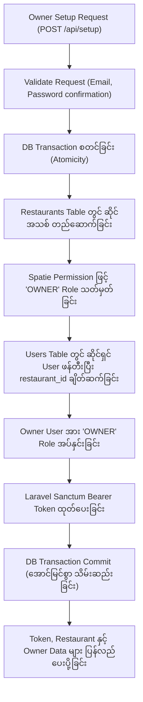

# အဆင့် (၃) - Restaurant Owner Authentication နှင့် Multi-Tenant Isolation စနစ် တည်ဆောက်ခြင်း ရှင်းလင်းချက်

ဤမှတ်တမ်းသည် Restaurant POS စနစ်၏ ပထမဆုံးသော Authentication Architecture ဖြစ်သည့် **Restaurant Owner Setup & Login စနစ်**၊ **Laravel Sanctum API Token စနစ်**၊ **Spatie Laravel Permission (Role Management)** နှင့် စားသောက်ဆိုင်အလိုက် ဒေတာများ သီးခြားခွဲထုတ်ထားသော **`restaurant_id` Isolation** တည်ဆောက်ပုံ အဆင့်ဆင့်နှင့် အဘယ်ကြောင့် ဤနည်းလမ်းများကို အသုံးပြုရသနည်းဆိုသည့် အချက်များကို မြန်မာဘာသာဖြင့် အသေးစိတ် ရှင်းလင်းထားပါသည်။

---

## ၁။ စနစ်ဖွဲ့စည်းပုံ ခြုံငုံသုံးသပ်ချက် (Architecture Overview)

Restaurant POS စနစ်တစ်ခုတွင် သာမန် Website များကဲ့သို့ မည်သူမဆို Register ပြုလုပ်နိုင်သော Public User Registration စနစ် **လုံးဝ မရှိသင့်ပါ**။ စနစ်တစ်ခုလုံးကို စတင်အသုံးပြုမည့် ပထမဆုံး အသုံးပြုသူသည် **Restaurant Owner (ဆိုင်ရှင်)** သာ ဖြစ်ရပါမည်။

### Setup စတင်လည်ပတ်ပုံ အဆင့်ဆင့် (Setup Flow)


---

## ၂။ အကောင်အထည်ဖော်ခဲ့သော API Endpoint များ

| HTTP Method | Endpoint | လိုအပ်သော Auth | လုပ်ဆောင်ချက် ရှင်းလင်းချက် |
| :--- | :--- | :--- | :--- |
| `POST` | `/api/setup` | Public | ဆိုင်သစ်နှင့် ဆိုင်ရှင် (Owner) အကောင့်ကို တပြိုင်နက် ဖန်တီးပေးပြီး Bearer Token ထုတ်ပေးသည်။ |
| `POST` | `/api/login` | Public | Email နှင့် Password စစ်ဆေး၍ မှန်ကန်ပါက Sanctum Token၊ ဆိုင်အချက်အလက်နှင့် Roles များ ပြန်ပေးသည်။ မှားယွင်းပါက HTTP 401 ပြန်ပို့သည်။ |
| `GET` | `/api/me` | `auth:sanctum` | လက်ရှိ Login ဝင်ထားသော User၊ ချိတ်ဆက်ထားသော Restaurant နှင့် Role များကို ပြသသည်။ |
| `POST` | `/api/logout` | `auth:sanctum` | အသုံးပြုနေသော လက်ရှိ Sanctum Token ကို ဒေတာဘေ့စ်မှ ဖျက်ပစ်ပြီး Logout ပြုလုပ်သည်။ |

---

## ၃။ Database ဒီဇိုင်းနှင့် သီးခြားခွဲထုတ်မှု (Multi-Tenant Isolation)

### (က) `restaurants` Table
- `id`: Primary Key
- `name`: စားသောက်ဆိုင် အမည်
- `slug`: URL သို့မဟုတ် Tenant ခွဲခြားရန် အသုံးပြုသော Unique Slug (ဥပမာ - `european-kitchen`)
- `phone`, `email`, `address`: ဆိုင်၏ ဆက်သွယ်ရန် လိပ်စာများ (Nullable)
- `is_active`: ဆိုင်ဖွင့်/ပိတ် အခြေအနေ (Default: `true`)
- `timestamps`: `created_at`, `updated_at`

### (ခ) `users` Table နှင့် `restaurant_id`
- `users` table တွင် `restaurant_id` (Foreign Key) ကို ထည့်သွင်းထားပါသည်။
- **Relationship**:
  - `User` တစ်ယောက်သည် `Restaurant` တစ်ခုတည်း၌သာ တည်ရှိသည် (`belongsTo(Restaurant::class)`)။
  - `Restaurant` တစ်ခုတွင် ဝန်ထမ်း/ဆိုင်ရှင် `Users` များစွာ ရှိနိုင်သည် (`hasMany(User::class)`)။
  - `Restaurant` တွင် ဆိုင်ရှင်တစ်ဦးသာ ရှိပြီး `owner()` relationship အဖြစ် `hasOne(User::class)->whereHas('roles', fn($q) => $q->where('name', 'OWNER'))` ဖြင့် သတ်မှတ်ထားပါသည်။
  - ဤနည်းလမ်းသည် `restaurants` ဇယားတွင် `owner_id` ထပ်မံထည့်သွင်းစရာမလိုဘဲ Foreign Key သံသရာလည်မှု (Circular Reference) နှင့် ဒေတာ ထပ်နေမှု (Data Duplication) ကို လုံးဝ ကင်းဝေးစေပါသည်။

---

## ၄။ အဘယ်ကြောင့် ဤ Feature/Function များကို အသုံးပြုရသနည်း (Why Use Each Feature)

### (၁) အဘယ်ကြောင့် Laravel Sanctum ကို ရွေးချယ်သနည်း။
- **ပေါ့ပါးမြန်ဆန်ခြင်း**: Laravel Passport ကဲ့သို့ လေးလံသော OAuth2 Server ကြီး မလိုဘဲ Restaurant POS ၏ Mobile Tablet, Cashier Desktop နှင့် Kitchen Display များအတွက် လိုအပ်သော **Bearer Token** စနစ်ကို လုံခြုံစွာနှင့် အမြန်ဆုံး ပေးစွမ်းနိုင်ခြင်း။
- **Revocation Control**: စားသောက်ဆိုင်တွင် တက်ဘလက် သို့မဟုတ် စက်တစ်ခုခု ပျောက်ဆုံးသွားပါက Token တစ်ခုချင်းစီအလိုက် အချိန်မရွေး ဖျက်သိမ်း (Revoke) ပစ်နိုင်ခြင်း။

### (၂) အဘယ်ကြောင့် Spatie Laravel Permission ကို အသုံးပြုသနည်း။
- စားသောက်ဆိုင် POS တွင် ရာထူးတာဝန်များ အလွန်တိကျစွာ ခွဲခြားရန် လိုအပ်ပါသည် -
  - `OWNER`: ဆိုင်တစ်ခုလုံး၏ အစီရင်ခံစာများ၊ ဈေးနှုန်းများ၊ ဝန်ထမ်းများကို စီမံခန့်ခွဲသူ။
  - `MANAGER`: နေ့စဉ် အရောင်းစာရင်းနှင့် စားပွဲဝိုင်းများကို ကြီးကြပ်သူ။
  - `CASHIER`: ငွေလက်ခံခြင်း၊ ဘေလ်ထုတ်ပေးခြင်း သီးသန့် လုပ်ဆောင်သူ။
  - `STAFF`: စားပွဲထိုး အော်ဒါယူခြင်း သီးသန့် လုပ်ဆောင်သူ။
- Hardcoded Role Check များအစား စံချိန်စံညွှန်းမီ Spatie Permission ကို သုံးခြင်းဖြင့် နောင်တွင် Permission အသစ်များ (ဥပမာ: `void_bill`, `apply_discount`, `edit_menu`) ကို အလွယ်တကူ ထပ်မံဖြည့်စွက်နိုင်ပါသည်။

### (၃) အဘယ်ကြောင့် `restaurant_id` Multi-Tenant Isolation ကို အသုံးပြုသနည်း (POS အတွက် အသက်တမျှ အရေးကြီးချက်)။
- POS စနစ်တွင် မတူညီသော စားသောက်ဆိုင်များ၏ Menu, Orders, Sales, Customers စသည့် စာရင်းများသည် အချင်းချင်း ရောထွေးသွားခြင်း **လုံးဝ မရှိစေရပါ**။
- User တိုင်းတွင် `restaurant_id` ပါဝင်နေခြင်းဖြင့် အော်ဒါယူခြင်း၊ ငွေရှင်းခြင်း လုပ်ငန်းစဉ်တိုင်း၌ မိမိဆိုင်၏ ဒေတာများကိုသာ ကြည့်ရှုခွင့်နှင့် ပြင်ဆင်ခွင့် ရရှိစေရန် အာမခံချက် ပေးပါသည်။

### (၄) အဘယ်ကြောင့် `DB::transaction()` ကို Setup Endpoint တွင် အသုံးပြုရသနည်း။
- ဆိုင်အသစ် ဖန်တီးခြင်း၊ User ဖန်တီးခြင်း၊ Role အပ်နှင်းခြင်းနှင့် Token ထုတ်ပေးခြင်းတို့သည် တစ်ခုနှင့်တစ်ခု ချိတ်ဆက်နေပါသည်။
- အကယ်၍ ဆိုင်ဆောက်ပြီးမှ User ဆောက်သည့်အဆင့်တွင် Error ဖြစ်သွားပါက မပြီးပြတ်သော အမှိုက်ဒေတာ (Orphaned Restaurant) မကျန်ရှိစေရန် Database Transaction ဖြင့် အကုန်လုံး အလိုအလျောက် Rollback ပြန်လုပ်ပေးပါသည်။

---

## ၅။ ပြုပြင် / ဖန်တီးခဲ့သော ဖိုင်များ စာရင်း

1. **Migrations**:
   - `database/migrations/2026_09_22_000001_create_restaurants_table.php`
   - `database/migrations/2026_09_22_000002_add_restaurant_id_to_users_table.php`
   - `database/migrations/2026_09_21_155537_create_permission_tables.php` (Spatie)
   - `database/migrations/2026_09_21_155537_create_personal_access_tokens_table.php` (Sanctum)
2. **Models**:
   - `app/Models/Restaurant.php`
   - `app/Models/User.php`
3. **Form Requests**:
   - `app/Http/Requests/SetupRequest.php`
   - `app/Http/Requests/LoginRequest.php`
4. **Controllers & Routes**:
   - `app/Http/Controllers/Api/AuthController.php`
   - `routes/api.php`
   - `bootstrap/app.php`
5. **Seeders**:
   - `database/seeders/RoleSeeder.php`
   - `database/seeders/DatabaseSeeder.php`
6. **Feature Tests**:
   - `tests/Feature/Auth/RestaurantSetupTest.php`
   - `tests/Feature/Auth/AuthenticationTest.php`

---

## ၆။ စမ်းသပ်စစ်ဆေးမှု ရလဒ်များ (Test Results)

```bash
$ docker compose exec backend-app php artisan test

   PASS  Tests\Unit\ExampleTest
  ✓ that true is true

   PASS  Tests\Feature\Auth\AuthenticationTest
  ✓ login fails with invalid credentials returning 401                   0.16s  
  ✓ login succeeds and returns token user restaurant and roles           0.01s  
  ✓ me endpoint requires authentication                                  0.01s  
  ✓ me endpoint returns authenticated owner and restaurant               0.01s  
  ✓ logout revokes current token                                         0.01s  

   PASS  Tests\Feature\Auth\RestaurantSetupTest
  ✓ restaurant setup succeeds and creates owner with role and token      0.01s  
  ✓ setup fails with duplicate email                                     0.01s  
  ✓ setup fails with password confirmation mismatch                      0.01s  
  ✓ password is never returned in api response                           0.01s  
  ✓ setup transaction rolls back when operation fails                    0.01s  

   PASS  Tests\Feature\ExampleTest
  ✓ the application returns a successful response                        0.02s  

  Tests:    12 passed (61 assertions)
  Duration: 0.42s
```
