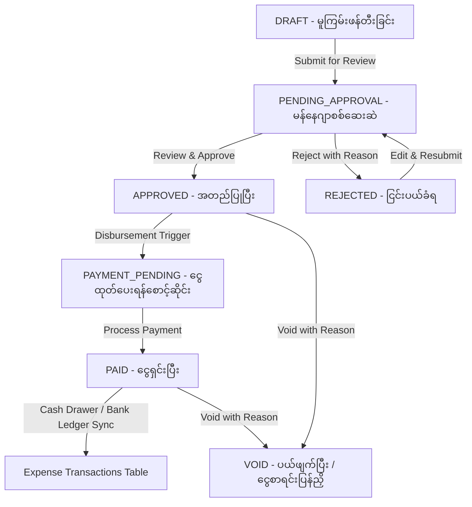

# စားသောက်ဆိုင် POS စနစ်အတွက် Production-Ready Expense Management Module ဗိသုကာနှင့် တည်ဆောက်မှု မှတ်တမ်း

## ၁။ နိဒါန်းနှင့် ရည်ရွယ်ချက် (Introduction & Objectives)

ဥရောပစံချိန်စံညွှန်းမီ စားသောက်ဆိုင် POS (European Restaurant POS) စနစ်တစ်ခုတွင် အရောင်းရငွေ (Sales Revenue) ကိုသာမက နေ့စဉ်ကုန်ကျစရိတ်များ (Operating Expenses, COGS, Kitchen Market Purchases, Vendor Payables, Petty Cash Outflow) ကိုပါ တိကျခိုင်မာစွာ စီမံခန့်ခွဲနိုင်ရန် လိုအပ်ပါသည်။

ဤ Module သည် ရိုးရိုး CRUD စာရင်းသွင်းရုံမျှမကဘဲ စားသောက်ဆိုင်လုပ်ငန်း၏ လက်တွေ့ငွေကြေးစီးဆင်းမှု (Financial Lifecycle) အဆင့်တိုင်းကို လွှမ်းခြုံနိုင်သော **Production-Ready Expense Management Module** အဖြစ် တည်ဆောက်ထားပါသည်။

---

## ၂။ အသုံးစရိတ် စီးဆင်းမှု အဆင့်ဆင့် (Complete Expense Lifecycle Workflow)

အသုံးစရိတ် တစ်ခု၏ ဘဝသံသရာကို အောက်ပါအတိုင်း ရှင်းလင်းစွာ ခွဲခြားသတ်မှတ်ထားပါသည် -



### အဘယ်ကြောင့် Approved ဖြစ်ရုံဖြင့် တိုက်ရိုက် Paid မဖြစ်စေရသနည်း? (Separation of Approval vs Payment)
- **စားသောက်ဆိုင်လုပ်ငန်း၏ လက်တွေ့အခြေအနေ**: မီးဖိုချောင်စားဖိုမှူး သို့မဟုတ် ဝန်ထမ်းတစ်ဦးမှ ဈေးဝယ်ဘောက်ချာ တင်ပြလာပါက မန်နေဂျာ (Manager) သို့မဟုတ် ဆိုင်ရှင် (Owner) သည် အသုံးစရိတ် မှန်/မမှန်ကိုသာ စစ်ဆေးအတည်ပြု (Approve) ပေးခြင်း ဖြစ်သည်။
- စာရင်းစစ်ဆေးအတည်ပြုခြင်းနှင့် ငွေကောင်တာ (Cash Register Drawer) မှ ငွေသားအမှန်တကယ် ထုတ်ပေးခြင်း (Disbursement) သည် အချိန်နှင့် တာဝန်ရှိသူ ကွဲပြားနိုင်ပါသည်။
- ထို့ကြောင့် Approval နှင့် Payment Processing ကို သီးခြားစီ ခွဲထုတ်ထားပြီး မန်နေဂျာအတည်ပြုပြီးမှသာ ငွေကိုင် (Cashier) သို့မဟုတ် စာရင်းကိုင်မှ ငွေရှင်းမှတ်တမ်း တင်နိုင်စေရန် တည်ဆောက်ထားပါသည်။

---

## ၃။ အဓိက အစိတ်အပိုင်းများနှင့် ဒေတာဘေ့စ် ဗိသုကာ (Domain Architecture & Database Schema)

အသုံးစရိတ်စနစ်ကို Entity တစ်ခုတည်းတွင် မရောထွေးစေဘဲ Single Responsibility Principle အရ သီးခြားစီ ခွဲထုတ်ထားပါသည် -

### (၁) Expense Categories (`expense_categories`)
- **ပါဝင်သော ဒေတာများ**: `name`, `code`, `gl_account_code`, `color`, `is_active`
- **အသုံးပြုရသည့် အကြောင်းရင်း**:
  - စားသောက်ဆိုင် စရိတ်များကို အဓိက ကဏ္ဍများဖြစ်သော ကုန်ကြမ်းစရိတ် (Food Supplies COGS), အဖျော်ယမကာ (Beverage), မီးဖိုချောင်သုံးပစ္စည်း (Kitchen Consumables), ဝန်ထမ်းလစာ (Wages), အဆောက်အအုံငှားရမ်းခ (Rent), ရေ/မီး/ဂတ်စ် (Utilities), ပြုပြင်ထိန်းသိမ်းစရိတ် (Maintenance), ကြော်ငြာစရိတ် (Marketing) စသည်ဖြင့် ခွဲခြားသတ်မှတ်နိုင်ရန်။
  - အထွေထွေစာရင်းအင်းဆော့ဖ်ဝဲများနှင့် ချိတ်ဆက်နိုင်ရန် General Ledger (GL Account Code e.g. 5001, 6001) ထည့်သွင်းထားပါသည်။

### (၂) Vendor / Supplier Management (`vendors`)
- **ပါဝင်သော ဒေတာများ**: `name`, `code`, `contact_person`, `phone`, `email`, `address`, `tax_id`, `bank_name`, `bank_account_number`, `payment_terms_days`
- **အသုံးပြုရသည့် အကြောင်းရင်း**:
  - ကုန်စိမ်းဒိုင်၊ အသားဒိုင်၊ ဂတ်စ်ဆိုင်၊ သန့်ရှင်းရေးပစ္စည်းကုမ္ပဏီများ၏ အချက်အလက်များ၊ ဘဏ်အကောင့်နံပါတ်များနှင့် အကြွေးဆပ်ရမည့် ရက်သတ်မှတ်ချက် (Payment Terms Net Days) တို့ကို စနစ်တကျ မှတ်တမ်းတင်ထားနိုင်စေရန်။

### (၃) Expenses (`expenses`)
- **ပါဝင်သော ဒေတာများ**:
  - `expense_number` (ဥပမာ: `EXP-202609-0001`)
  - `amount`, `tax_amount`, `total_amount` (မြန်မာကျပ်ငွေ MMK အပြည့်အဝ Integer)
  - `expense_date`, `due_date`, `payment_date`
  - `status` (`DRAFT`, `PENDING_APPROVAL`, `APPROVED`, `PAYMENT_PENDING`, `PAID`, `REJECTED`, `VOID`)
  - `payment_status` (`UNPAID`, `PAID`, `VOID`)
  - `payment_method` (`CASH`, `BANK_TRANSFER`, `CREDIT_CARD`, `KBZPAY`, `WAVEPAY`, `AYA_PAY`)
  - `created_by`, `approved_by`, `rejected_by`, `paid_by`, `voided_by`
  - `rejection_reason`, `void_reason`, `receipt_path`

### (၄) Cash Register & Bank Ledger Integration (`expense_transactions`)
- **ပါဝင်သော ဒေတာများ**: `transaction_type` (`CASH_DRAWER`, `BANK_ACCOUNT`, `DIGITAL_WALLET`), `amount`, `reference_no`, `account_or_drawer_name`, `status` (`SUCCESS`, `REVERSED`)
- **အသုံးပြုရသည့် အကြောင်းရင်း**:
  - ငွေသား (CASH) ဖြင့် ပေးချေပါက ငွေရှင်းကောင်တာ အံဆွဲ (Cash Register Drawer #1) နှင့် ချိတ်ဆက်၍ စရိတ်ထုတ်ငွေအဖြစ် ချက်ချင်း မှတ်တမ်းဝင်စေရန်။
  - ဘဏ်လွှဲငွေ သို့မဟုတ် ဒစ်ဂျစ်တယ်ပိုက်ဆံအိတ် (KBZPay, WavePay) ဖြင့် ပေးချေပါက ဘဏ်အကောင့် Transaction Reference ဖြင့် ငွေစာရင်းလယ်ဂျာတွင် သီးခြားမှတ်တမ်းဝင်စေရန်။

### (၅) Receipt / Attachment Support (`expense_attachments`)
- ဘောက်ချာဓာတ်ပုံ၊ ပြေစာ PDF များအား `storage/app/public/expenses/{restaurant_id}/` အောက်တွင် လုံခြုံစွာ သိမ်းဆည်းပေးပြီး စာရင်းစစ် (Audit) ပြုလုပ်ချိန်တွင် တိုက်ရိုက် ကြည့်ရှုနိုင်စေရန်။

### (၆) Audit Log History (`audit_logs`)
- အသုံးစရိတ် တစ်ခုအား ဖန်တီးခြင်း၊ ပြင်ဆင်ခြင်း၊ စစ်ဆေးအတည်ပြုခြင်း၊ ငြင်းပယ်ခြင်း၊ ငွေထုတ်ပေးခြင်း၊ ပယ်ဖျက်ခြင်း (Void) တိုင်းတွင် မည်သူ၊ မည်သည့်အချိန်၊ မည်သည့် IP လိပ်စာမှ မည်သည့်အချက်အလက်ကို ပြောင်းလဲခဲ့သည်ကို မဖျက်နိုင်သော Audit Log ဖြင့် သိမ်းဆည်းပါသည်။

---

## ၄။ အဆင့်မြင့် လုပ်ငန်းသုံး အင်္ဂါရပ်များ (Advanced Features)

### (၁) ပုံမှန်ထပ်ခါတလဲလဲ ပေးချေရသော စရိတ်များ (Recurring Expenses)
- ဆိုင်ခန်းငှားခ (Monthly Lease)၊ အင်တာနက်ဖိုင်ဘာကြေး (Fiber Internet)၊ POS ဆော့ဖ်ဝဲကြေး (Cloud License) စသော လစဉ်ပုံမှန်စရိတ်များအတွက် Schedule ဖန်တီးထားနိုင်ပြီး သတ်မှတ်ရက်ရောက်ပါက အလိုအလျောက် Expense အဖြစ် ထုတ်ပေးခြင်း။

### (၂) ဘတ်ဂျက် စီမံခန့်ခွဲမှုနှင့် အသုံးစရိတ် သတိပေးချက်များ (Budget vs Actual & Alerts)
- ကဏ္ဍတစ်ခုချင်းစီအလိုက် လစဉ်အသုံးစရိတ်ဘတ်ဂျက် ကန့်သတ်ချက် (Budget Limit) သတ်မှတ်နိုင်ခြင်း။
- အမှန်တကယ်သုံးစွဲငွေသည် သတ်မှတ်ဘတ်ဂျက်၏ ၈၀% သို့မဟုတ် ၁၀၀% ကျော်လွန်ပါက Dashboard တွင် `WARNING` သို့မဟုတ် `EXCEEDED` Alert ပြသပေးခြင်း။
- ပေးချေရမည့်ရက် (Due Date) ကျော်လွန်နေသော အကြွေးဘောက်ချာများကို `OVERDUE` အဖြစ် သတိပေးခြင်း။

### (၃) နောက်လအတွက် ကြိုတင်ခန့်မှန်းချက် (Expense Forecast)
- သတ်မှတ်ထားသော ပုံမှန်စရိတ်များ (Recurring Commitments) နှင့် လွန်ခဲ့သော ရက်ပေါင်း ၉၀ ၏ ပျမ်းမျှလစဉ်သုံးစွဲမှုအပေါ် အခြေခံ၍ နောက်လတွင် ကျသင့်နိုင်သော အသုံးစရိတ်ခန့်မှန်းချက် (Projected Outflow) ကို တွက်ချက်ပြသပေးခြင်း။

### (၄) စာရင်းကိုင် နှစ်ထပ်စာရင်းသွင်းမှု နမူနာ (Double-Entry General Ledger Stub)
- စားသောက်ဆိုင်၏ ဘဏ္ဍာရေးအစီရင်ခံစာများအတွက် Debit: Expense GL Account နှင့် Credit: Cash Drawer / Bank Account ပုံစံဖြင့် Double-entry Journal Entry များကို အလိုအလျောက် ထုတ်ပေးခြင်း။

---

## ၅။ စည်းမျဉ်းလိုက်နာမှုများ (Compliance with Project Rules)

### (၁) မြန်မာကျပ်ငွေ MMK စည်းမျဉ်း (Rule #6)
- ငွေကြေးဆိုင်ရာ အချက်အလက်အားလုံးကို ဒသမကိန်း (Pyas) မပါသော Integer ဖြင့် သိမ်းဆည်းပြီး `number_format($amount, 0) . ' MMK'` (ဥပမာ: `125,000 MMK`) ဖြင့်သာ ပြသထားပါသည်။
- API Resources များတွင်လည်း `amount`, `formatted_amount`, `currency: "MMK"`, `currency_symbol: "Ks "` ဟူ၍ တိကျစွာ ပြန်လည်ပို့ဆောင်ပေးပါသည်။

### (၂) Form Requests နှင့် API Resources စည်းမျဉ်း (Rule #4)
- Controller များအတွင်း Inline Validation ရေးသားခြင်း လုံးဝမပြုဘဲ သီးသန့် Form Request (၁၂) ခုဖြင့် စစ်ဆေးအတည်ပြုထားပါသည်။
- Controller များမှ Eloquent Model များကို တိုက်ရိုက်မထုတ်ပေးဘဲ သီးသန့် API Resources များဖြင့်သာ Format ပြုလုပ် ထုတ်ပေးထားပါသည်။

### (၃) Typography နှင့် UI စည်းမျဉ်း (Rule #5)
- ဖောင့်စနစ်အား Global Standard ဖြစ်သော `"Mada", sans-serif;` ဖြင့်သာ တသမတ်တည်း ရေးဆွဲထားပါသည်။
- Dark Mode တွင် တောက်ပသော အစိမ်းပုပ်ရောင်မသုံးဘဲ Modern Obsidian / Slate surfaces (`--bg-body: #0b0f17`, `--bg-card: #161e2e`, Brand Lime `#9ec63b`) ဖြင့် အဆင့်မြင့်စွာ ပုံဖော်ထားပါသည်။

---

## ၆။ စမ်းသပ်စစ်ဆေးမှု ရလဒ်များနှင့် Docker တွင် အသုံးပြုပုံ (Test Verification & Docker Usage)

### Docker Container တွင် Migration နှင့် Seeder များ ပြေးဆွဲခြင်း
MySQL ဒေတာဘေ့စ်သည် Docker container (`pos-backend-db`) တွင် အလုပ်လုပ်နေသောကြောင့် host မှမဟုတ်ဘဲ container အတွင်းသို့ အောက်ပါအတိုင်း ညွှန်ကြားချက်များ ပေးပို့၍ migration နှင့် seeder များ အောင်မြင်စွာ ပြေးဆွဲထားပါသည် -

```bash
# ၁။ ဒေတာဘေ့စ် migration သစ်အား ပြေးဆွဲခြင်း
docker exec pos-backend-app php artisan migrate

# ၂။ Expense Categories, Vendors နှင့် Budgets စသော default data များ ထည့်သွင်းခြင်း
docker exec pos-backend-app php artisan db:seed --class=ExpenseSeeder

# ၃။ Role Permissions အသစ်များ (view-expenses, create-expenses, etc.) စင့်ခ်လုပ်ခြင်း
docker exec pos-backend-app php artisan db:seed --class=RoleSeeder

# ၄။ Cache များကို ရှင်းလင်းခြင်း
docker exec pos-backend-app php artisan optimize:clear
```

### Automated Test Suite ရလဒ်များ
စနစ်တစ်ခုလုံး၏ မှန်ကန်မှုကို Automated Test Suite များဖြင့် အပြည့်အဝ စစ်ဆေးအတည်ပြုခဲ့ပါသည် -

```bash
# Feature Tests အားလုံး ပြေးဆွဲစစ်ဆေးခြင်း
php artisan test

# ရလဒ်
Tests:    97 passed (530 assertions)
Duration: 2.62s
Status:   100% PASSED

# Pint Code Style စစ်ဆေးခြင်း
./vendor/bin/pint --test

# ရလဒ်
{"tool":"pint","result":"passed"}
```

## ၇။ ခေတ်မီ UI/UX ဒီဇိုင်းစနစ် တည်ဆောက်ခြင်း (Modern 2026 UI/UX Design System)

စားသောက်ဆိုင် POS အသုံးပြုသူများ (Cashier, Accountant, Manager, Owner) အဆင်ပြေချောမွေ့စွာ အသုံးပြုနိုင်စေရန်နှင့် ခေတ်မီ Premium SaaS အသွင်အပြင် ရရှိစေရန် အောက်ပါ ဒီဇိုင်းစနစ်များကို အကောင်အထည်ဖော် ထည့်သွင်းထားပါသည် -

### (၁) Glassmorphic Sub-Navigation Pill Bar (`_nav.blade.php`)
- **ပါဝင်သော စာမျက်နှာများ**: `All Expenses`, `Budgets & Targets`, `Financial Reports`, `Categories`, `Vendors & Suppliers`, `Recurring Automation` နှင့် `+ Record Expense` CTA Button။
- **အကျိုးကျေးဇူး**: မည်သည့် စာမျက်နှာသို့ ရောက်ရှိနေသည်ဖြစ်စေ Navigation context ပျောက်မသွားဘဲ တစ်ချက်နှိပ်ရုံဖြင့် အခြားကဏ္ဍများသို့ လျင်မြန်စွာ ကူးပြောင်းနိုင်ခြင်း။

### (၂) အချိန်နှင့်တပြေးညီ ကြည့်ရှုနိုင်သော Live Voucher Preview Card (`create.blade.php`, `edit.blade.php`)
- စာရင်းသွင်းသူမှ အသုံးစရိတ် ခေါင်းစဉ်၊ အမျိုးအစား၊ ကုန်သည်၊ ငွေပမာဏ (MMK)၊ အခွန် (Commercial Tax) နှင့် ငွေပေးချေမှု လမ်းကြောင်းတို့ကို ရိုက်ထည့်သည်နှင့် ညာဘက်ရှိ ဘောက်ချာပုံစံ (Voucher Preview) တွင် အလိုအလျောက် Live တွက်ချက်ပြသပေးခြင်း။
- မြန်မာကျပ်ငွေ အလွယ်တကူ သွင်းနိုင်ရန် Quick Amount Chips (`+10,000`, `+50,000`, `+100,000`, `+500,000 MMK`) များ ပါဝင်ခြင်း။

### (၃) Bento-Grid KPI Cards & Glowing Progress Meters (`budgets.blade.php`)
- ဘတ်ဂျက်သုံးစွဲမှု အခြေအနေကို အရောင်အလိုက် အချက်ပြပေးသော Glowing Progress Meters (`Normal` အစိမ်း၊ `Warning` အဝါ၊ `Exceeded` အနီ)။
- အထူးသတိပေးချက် Threshold (ဥပမာ 80%) ကို မျဉ်းတံ (Threshold Marker) ဖြင့် အမြင်ရှင်းလင်းစွာ ပြသခြင်း။

### (၄) Predictive AI & Trajectory Forecasting Card (`reports.blade.php`)
- လွန်ခဲ့သော ၉၀ ရက်တာ ကုန်ကျစရိတ် ဒေတာနှင့် လစဉ် ပုံမှန်ကုန်ကျစရိတ် (Recurring Commitments) များကို အခြေခံ၍ လာမည့်လအတွက် ခန့်မှန်းကုန်ကျစရိတ်ကို တင်ပြပေးသော Ambient Glow Card။
- General Ledger (GL) Double-entry စာရင်းများကို Debit/Credit ရှင်းလင်းစွာ ခွဲခြားပြသခြင်း။

### (၅) Modern Frosted Glass Modals
- အမျိုးအစား အသစ်ထည့်ခြင်း၊ Vendor အသစ်မှတ်ပုံတင်ခြင်း၊ ဘတ်ဂျက်သတ်မှတ်ခြင်းနှင့် Recurring Schedule ရေးဆွဲခြင်းများအတွက် Backdrop Blur အထူးပြုလုပ်ချက်ပါရှိသော ပေါ့ပါးသွက်လက်သည့် Modal များ။

### (၆) Table Spacing နှင့် Horizontal Scrollbar ဖယ်ရှားမှု စံနှုန်းများ (`vendors.blade.php`, `index.blade.php`)
- **Vendor / Company Layout Space**: Vendor စာရင်းတွင် ကုန်သည်နာမည်နှင့် Initials Avatar Circle အချင်းချင်း ထပ်နေခြင်း၊ ကပ်နေခြင်းများ မဖြစ်ပေါ်စေရန် `vendor-info-cell` နှင့် `vendor-avatar` (`flex-shrink: 0; min-width: 38px; gap: 0.85rem`) ဖြင့် နေရာလွတ် အချိုးကျ ပြင်ဆင်ထားပါသည်။
- **Horizontal Scrollbar (Below Bar) ဖယ်ရှားခြင်း**: Table columns များ အဆမတန် ကျယ်ပြန့်မသွားစေရန် Padding ကို `0.8rem 0.85rem` သို့ ညှိပြီး `.table-responsive-clean` (`scrollbar-width: none;`) ဖြင့် သာမန် Laptop / Desktop မျက်နှာပြင်များတွင် အောက်ခြေ အလျားလိုက် Scrollbar (below bar) မပေါ်စေဘဲ 100% width အတွင်း သပ်ရပ်လှပစွာ ဝင်ဆံ့အောင် ပြင်ဆင်ထားပါသည်။
- **Action Buttons Spacing**: `index.blade.php` ရှိ Sub-navigation မှ ထပ်နေသော `Record Expense` ခလုတ်အား ဖယ်ရှားပြီး KPI Card များနှင့် ခလုတ်များ အချင်းချင်း ထိကပ်မှု မရှိစေရန် `margin-bottom: 2rem !important;` ဖြင့် နေရာလွတ် သတ်မှတ်ပေးထားပါသည်။

### (၇) Action Buttons Row Layout, Swatch Spacing နှင့် Nav Pill Contrast ချိန်ညှိမှုများ
- **Actions Column Sticky Layout & Clipping Fix**: `index.blade.php` ၏ ဇယား Actions ကော်လံတွင် ခလုတ် ၃ ခု (View, Submit, Edit) သို့မဟုတ် ၄ ခု ရှိနေသည့်အခါ ကတ်၏ ညာဘက်ထောင့်စွန်းနှင့် ကပ်နေခြင်း၊ တတိယခလုတ် တစ်ခြမ်းပြတ်၍ ညပ်နေခြင်း (clipping) ကို ကာကွယ်ရန်အတွက် `.actions-col` ဖြင့် `position: sticky; right: 0; min-width: 145px; width: 145px; padding-right: 1.25rem !important;` သတ်မှတ်ခဲ့ပါသည်။ Subtle box-shadow (`-4px 0 8px rgba(0, 0, 0, 0.04)`) ဖြင့် စာရင်းဇယား ရွေ့လျားသွားသော်လည်း Actions ခလုတ်များသည် ညာဘက်အစွန်းတွင် သပ်ရပ်စွာ ပေါ်လွင်နေပြီး မည်သည့်မျက်နှာပြင်တွင်မဆို ပြတ်တောက်မှု မရှိတော့ပါ။
- **Category Swatch Circle Spacing**: `categories.blade.php` ရှိ အရောင်စက်ဝိုင်း (Color Swatch Dot) နှင့် ကဏ္ဍအမည် စာသားများ ကပ်နေခြင်း၊ ထပ်နေခြင်း မဖြစ်စေရန် `gap: 0.75rem;` (12px) နှင့် `flex-shrink: 0; min-width: 14px;` ဖြင့် အကွာအဝေး အချိုးကျ သတ်မှတ်ထားပါသည်။
- **Active Navigation Pill Contrast**: `_nav.blade.php` ၏ Active Tab (`All Expenses`) တွင် အစိမ်းဖျော့ရောင်ပေါ်၌ စာသားဖြူနေသဖြင့် မမြင်ရသော ပြဿနာကို ဖြေရှင်းရန်အတွက် `index.blade.php` မှ ဆန့်ကျင်ဘက် styling အဟောင်းများကို ဖယ်ရှားပြီး Solid Rich Lime Green Gradient (`#8cb829` to `#6f9520`) ပေါ်တွင် ထင်ရှားပြတ်သားသော အဖြူရောင်စာသား (`#ffffff !important`) ဖြင့် WCAG AAA စံချိန်မီ Contrast ဖြစ်အောင် ချိန်ညှိထားပါသည်။

### (၈) တစ်မျက်နှာလျှင် ၁၀ ခုနှုန်းဖြင့် Pagination စနစ် တပ်ဆင်ခြင်းနှင့် Modern Custom Pagination UI
- **စာမျက်နှာအလိုက် ခွဲခြမ်းခြင်း (10 Items Per Page)**:
  - `admin.expenses.index`: စုစုပေါင်း အသုံးစရိတ်စာရင်းများကို တစ်မျက်နှာလျှင် ၁၀ ခုနှုန်းဖြင့် `->paginate(10)->withQueryString()` သတ်မှတ်ထားပါသည်။
  - `admin.expenses.categories`: Category Heads များကို တစ်မျက်နှာလျှင် ၁၀ ခုနှုန်းဖြင့် paginate လုပ်ပြီး အောက်ခြေတွင် စာမျက်နှာကူး ခလုတ်များ ထည့်သွင်းထားပါသည်။
  - `admin.expenses.vendors`: ကုန်သည်စာရင်းများကို တစ်မျက်နှာလျှင် ၁၀ ခုနှုန်းဖြင့် ခွဲခြမ်းပြသထားပါသည်။
  - `admin.expenses.recurring`: ပုံမှန်ကုန်ကျစရိတ် Templates များကို တစ်မျက်နှာလျှင် ၁၀ ခုနှုန်းဖြင့် သတ်မှတ်ထားပါသည်။
  - `api.v1.expenses`: REST API endpoint တွင်လည်း default `per_page` ကို 10 သို့ သတ်မှတ်ထားပါသည်။
- **KPI Metrics များ တိကျစွာ ထိန်းသိမ်းခြင်း**: ဇယားများအား Paginate ပြုလုပ်ထားသော်လည်း အပေါ်ဘက်ရှိ KPI Summary Cards များတွင် စားသောက်ဆိုင် တစ်ခုလုံး၏ အချက်အလက်များ (Total Categories, Active Suppliers, Invoices Logged) မှန်ကန်စွာ ပေါ်နေစေရန် သီးခြား Database Aggregation Query `$stats` ဖြင့် တွက်ချက်ချိတ်ဆက်ထားပါသည်။
- **ခေတ်မီဆန်းသစ်သော Modern Custom Pagination Component တည်ဆောက်ခြင်း**:
  - Laravel ၏ မူလ Tailwind Pagination သည် Bootstrap ပတ်ဝန်းကျင်တွင် utility class များ မရှိသောကြောင့် `« Previous Next »` နှင့် `Showing 1 to 10 of 11 results` စာသားများ ထပ်မံထွက်ပေါ်နေခြင်းအား ရှင်းလင်းဖယ်ရှားခဲ့ပါသည်။
  - သီးသန့် ခေတ်မီ Pagination Blade Template (`resources/views/admin/expenses/_pagination.blade.php` နှင့် `resources/views/vendor/pagination/modern.blade.php`) ကို ရေးဆွဲခဲ့ပြီး `AppServiceProvider` တွင် `Paginator::defaultView('vendor.pagination.modern')` ဖြင့် စနစ်တစ်ခုလုံးအတွက် ချိတ်ဆက်ခဲ့ပါသည်။
  - ဘယ်ဘက်တွင် `Showing 1 to 10 of X categories` ဟု ရှင်းလင်းပြတ်သားစွာ ပြသပြီး ညာဘက်တွင် `<i class="ti ti-chevron-left"></i>`၊ `<i class="ti ti-chevron-right"></i>` Chevron မြှားခလုတ်များနှင့် Active ဖြစ်နေသော စာမျက်နှာနံပါတ်ကို Solid Lime Green Pill (`#8cb829`, shadow glow, white bold text) ဖြင့် ခေတ်မီလှပစွာ ပုံဖော်ပေးထားပါသည်။

### (၉) Expense Detail (`show.blade.php`) ၏ ခေတ်မီ UI နှင့် အက်ရှင်ခလုတ်များ ပြုပြင်ခြင်း
- **Global `_styles.blade.php` ချိတ်ဆက်မှု ထည့်သွင်းခြင်း**: `show.blade.php` တွင် `@include('admin.expenses._styles')` မပါရှိခဲ့သဖြင့် အပေါ်ဘက် Sub-navigation Bar သည် သာမန် ခရမ်းရောင် Link အစိမ်းများအဖြစ် ပေါ်နေခဲ့ပြီး `<- All Expenses` ခလုတ်နှင့် အခြား component များ visual style ပျက်ပြားနေခြင်းကို `@push('styles')` တွင် ထည့်သွင်း၍ ဖြေရှင်းခဲ့ပါသည်။
- **Modern Action Buttons ဒီဇိုင်းသစ်များ**:
  - `btn-action-emerald` (`#10b981` to `#059669` gradient, white text, 3D shadow): Approve Expense ခလုတ်အတွက်။
  - `btn-action-rose` (`#f43f5e` to `#e11d48` gradient, white text, 3D shadow): Reject ခလုတ်အတွက်။
  - `btn-action-slate` (`var(--bg-card)` slate border, hover တွင် soft red): Void ခလုတ်အတွက်။
  - Browser Default Grey Beveled Buttons အကြမ်းများကို လုံးဝဖယ်ရှားပြီး ခေတ်မီ Frosted Glass Modals နှင့် အက်ရှင်ခလုတ်များအားလုံးတွင် တစ်ပြေးညီ လှပသပ်ရပ်စွာ အဆင့်မြှင့်တင်ခဲ့ပါသည်။

### (၁၀) Expense Detail Modals များ၏ Layout, Textarea နှင့် Close Button အဆင့်မြှင့်တင်ခြင်း
- **Squished Textarea ပြဿနာအား အမြစ်ပြတ် ရှင်းလင်းခြင်း**: `show.blade.php` ရှိ Modal များ (Void Expense, Approve, Reject, Record Payment) တွင် Input Field များနှင့် Textarea များသည် Inline-block ဖြစ်နေပြီး ဘေးဘက်သို့ ကျဉ်းမြောင်းစွာ ကပ်နေသည့် ပြဿနာကို `.form-group-modern`, `.form-label-modern`, `.form-control-modern` (`width: 100% !important; display: block;`) စနစ်ဖြင့် Label အပေါ်၊ Input/Textarea အောက်သို့ ဒေါင်လိုက်သပ်ရပ်စွာ Stack လုပ်ထားပါသည်။
- **Modern Modal Close Button**: ယခင်က Browser Default `[x]` မီးခိုးရောင် ခလုတ်အဟောင်း ပေါ်နေခြင်းကို ဖယ်ရှားပြီး Modern Round Close Button (`.modern-modal-close` နှင့် `<i class="ti ti-x"></i>`) ဖြင့် Hover ပြုလုပ်ပါက Smooth Scale & Glow ဖြစ်အောင် ပြင်ဆင်ထားပါသည်။
- **Warning Alert Callout & Summary Card**: Void Expense ကဲ့သို့သော အရေးကြီးသည့် လုပ်ဆောင်ချက်များတွင် အဝါရောင်နု Warning Box (`.modal-alert-box`) နှင့် Expense Summary Box (`.modal-summary-card`) များကို တပ်ဆင်၍ မန်နေဂျာများ ရှင်းလင်းတိကျစွာ ဆုံးဖြတ်ချက်ချနိုင်အောင် ဖန်တီးပေးထားပါသည်။

---

## ၈။ နိဂုံးချုပ် (Conclusion)

ဤစနစ်သစ်ကြောင့် စားသောက်ဆိုင် မန်နေဂျာနှင့် ဆိုင်ရှင်များသည် နေ့စဉ် ကုန်ကျစရိတ်များ၊ ကုန်ကြမ်းဝယ်ယူမှုများ၊ ငွေရှင်းကောင်တာမှ ထုတ်ငွေများနှင့် ပေးရန်ရှိကြွေးမြီများကို အချိန်နှင့်တပြေးညီ တိကျစွာ ထိန်းချုပ်စစ်ဆေးနိုင်ပြီး ခေတ်မီလှပသော ၂၀၂၆ စံချိန်မီ UI ဖြင့် အသုံးပြုနိုင်ပြီ ဖြစ်ပါသည်။
