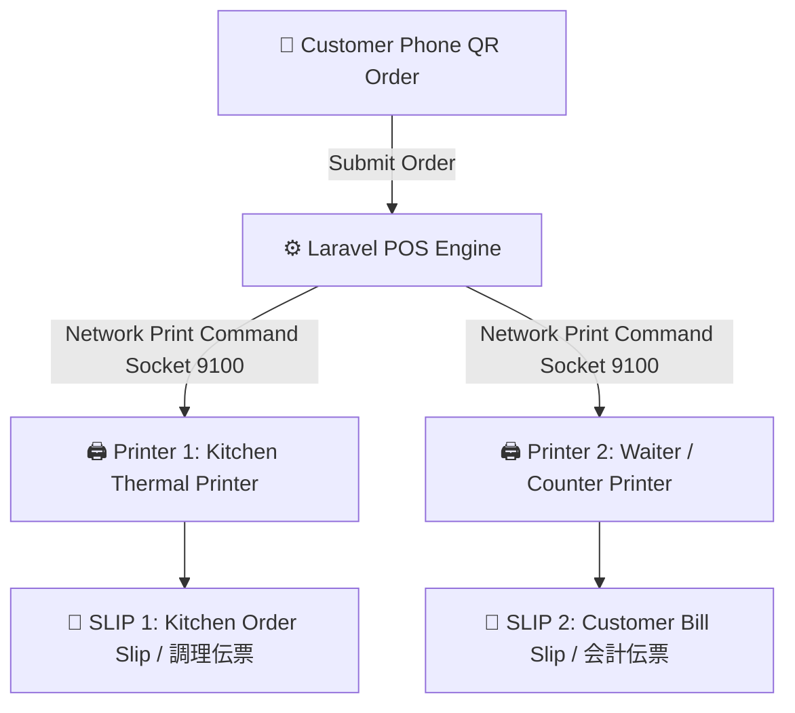
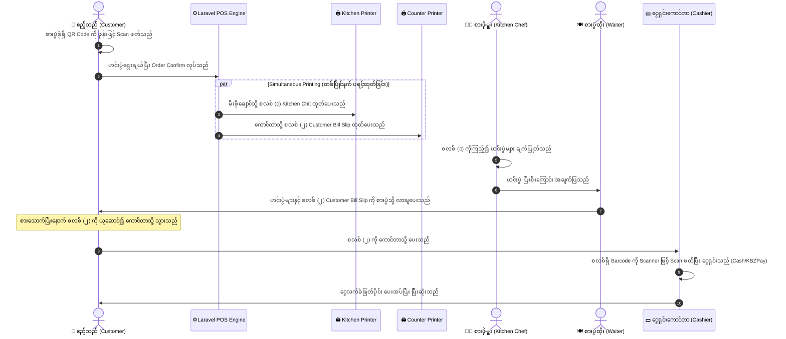

# Saizeriya (ဂျပန်) စတိုင်လ် Dual-Printer Table QR Order & POS Architecture

## ၁။ နိဒါန်းနှင့် ရည်ရွယ်ချက် (Introduction & Purpose)

ဂျပန်နိုင်ငံ၏ စံပြစားသောက်ဆိုင်ကြီးများ (ဥပမာ- Saizeriya) နှင့် Luxury စားသောက်ဆိုင်များတွင် မီးဖိုချောင် (Kitchen) အတွင်း PC သို့မဟုတ် Screen များ မထားရှိဘဲ **Dual Thermal Network Printer (အော်ဒါစလစ် ၂ မျိုး အလိုအလျောက် ပရင့်ထုတ်သည့်စနစ်)** ကို အဓိက အသုံးပြုကြပါသည်။

Customer က စားပွဲခုံရှိ QR Code ကို မိမိဖုန်းဖြင့် Scan ဖတ်ပြီး အော်ဒါတင်လိုက်သည်နှင့် တစ်ပြိုင်နက် ပရင်တာ ၂ လုံးမှ **စလစ် ၂ မျိုး (Kitchen Order Chit + Customer Bill Slip)** အလိုအလျောက် တစ်ပြိုင်နက် ထွက်လာသည့် ဗိသုကာကို အောက်တွင် အသေးစိတ် ဖော်ပြထားပါသည်။

---

## ၂။ အဘယ်ကြောင့် မီးဖိုချောင်တွင် PC မသုံးဘဲ Printer-Only စနစ်ကို သုံးရသနည်း? (Why No PC in Kitchen?)

1. **မီးဖိုချောင်၏ ပတ်ဝန်းကျင် (Kitchen Environment)**:
   - မီးဖိုချောင်တွင် အပူရှိန်၊ ဆီငွေ့၊ ရေငွေ့နှင့် စိုထိုင်းဆများပြားသဖြင့် PC / iPad စခရင်များ ထားရှိပါက အလွယ်တကူ ပျက်စီးနိုင်ပါသည်။
2. **စားဖိုမှူးများ၏ လက်တွေ့လုပ်ငန်းခွင် (Chefs' Workflow)**:
   - စားဖိုမှူးများသည် အစားအသောက် ကိုင်တွယ်ချက်ပြုတ်နေချိန်တွင် လက်စိုနေခြင်း သို့မဟုတ် လက်အိတ်စွပ်ထားခြင်းကြောင့် Touchscreen ကို ထိတွေ့နှိပ်ရန် မလွယ်ကူပါ။
3. **စက္ကူစလစ်၏ အားသာချက် (Paper Slip Advantage)**:
   - Thermal Printer မှ ထွက်လာသော မီးဖိုချောင်စလစ် (Kitchen Chit) ကို ဟင်းချက်စင် (Order Rail) တွင် ညှပ်ထားနိုင်ပြီး၊ ချက်ပြုတ်ပြီးစီးသော ဟင်းပွဲနှင့်အတူ စလစ်ကို စစ်ဆေးကာ အမှားအယွင်းမရှိ ပို့ဆောင်နိုင်ပါသည်။

---

## ၃။ အလိုအလျောက် ထွက်လာမည့် စလစ် (၂) မျိုး ဖွဲ့စည်းပုံ (2 Types of Order Slips)

Customer ဖုန်းမှ အော်ဒါတင်လိုက်သည်နှင့် အောက်ပါစလစ် (၂) စောင် တစ်ပြိုင်နက် ပရင့်ထွက်လာမည်ဖြစ်သည် -



---

### 📄 စလစ်အမျိုးအစား (၁) - မီးဖိုချောင် အော်ဒါစလစ် (Kitchen Order Slip / 調理伝票)

* **ထုတ်ပေးမည့်နေရာ**: မီးဖိုချောင်ရှိ အပူခံပရင်တာ (Kitchen Thermal Printer - 80mm).
* **ရည်ရွယ်ချက်**: စားဖိုမှူးများ မည်သည့်စားပွဲအတွက် မည်သည့်ဟင်းပွဲနှင့် အရေအတွက် ချက်ရမည်ကို ချက်ချင်းမြင်တွေ့နိုင်ရန်။
* **ထူးခြားချက်**: **ဈေးနှုန်းနှင့် အခွန် မပါဝင်ပါ** (ချက်ပြုတ်ရန်အတွက်သာ သီးသန့်ဖြစ်သည်)။ စားပွဲအမှတ်နှင့် ဟင်းပွဲအမည်များကို ဖောင့်အကြီးဖြင့် ပရင့်ထုတ်ပေးသည်။

```text
==================================================
              ** KITCHEN ORDER CHIT **
                   (調理指示伝票)
==================================================
TABLE NO:   >>> TABLE 04 <<< (Main Hall)
ORDER ID:   #ORD-20260926-0042
TIME:       26-Sep-2026  08:35 PM
GUESTS:     3 Persons
--------------------------------------------------
QTY   ITEM NAME                    SPECIAL NOTE
--------------------------------------------------
[ 2 ] Hamburg Steak (Beef)         Medium Well
[ 1 ] Milanese Doria Rice          Extra Cheese
[ 3 ] Sweet Corn Soup              Hot
[ 1 ] Italian Red Wine (Glass)     Room Temp
--------------------------------------------------
ORDER STATUS: NEW / PENDING COOK
==================================================
```

---

### 📄 စလစ်အမျိုးအစား (၂) - စားပွဲတင် ငွေရှင်းစလစ် (Customer Bill Slip / 会計伝票)

* **ထုတ်ပေးမည့်နေရာ**: ဝန်ထမ်းဂိတ် သို့မဟုတ် ကောင်တာရှိ ပရင်တာ (Waiter Station / Counter Thermal Printer - 80mm).
* **ရည်ရွယ်ချက်**: ဟင်းပွဲများ ချက်ပြုတ်ပြီးစီးချိန်တွင် Waiter မှ ဟင်းပွဲများနှင့်အတူ ဤစလစ်ကို ယူဆောင်၍ ဧည့်သည်၏ စားပွဲခုံရှိ စလစ်ကလစ်ခွက်တွင် သွားရောက်ထားရှိရန်။
* **ထူးခြားချက်**: ဟင်းပွဲအမည်များ၊ ဈေးနှုန်း (MMK)၊ အခွန် (Tax 5%)၊ စုစုပေါင်း ကျသင့်ငွေနှင့် ငွေရှင်းကောင်တာတွင် စကင်ဖတ်ရန် **Barcode / QR Code** ပါဝင်သည်။

```text
==================================================
                 SAIZERIYA POS
             CUSTOMER BILL SLIP (伝票)
==================================================
TABLE NO:     TABLE 04
ORDER ID:     #ORD-20260926-0042
DATE & TIME:  26-Sep-2026  08:35 PM
GUESTS:       3 Persons
--------------------------------------------------
ITEM                     QTY     PRICE      AMOUNT
--------------------------------------------------
Hamburg Steak (Beef)       2     8,500  17,000 MMK
Milanese Doria Rice        1     6,500   6,500 MMK
Sweet Corn Soup            3     3,000   9,000 MMK
Italian Red Wine           1    12,000  12,000 MMK
--------------------------------------------------
Subtotal:                               44,500 MMK
Commercial Tax (5%):                     2,225 MMK
--------------------------------------------------
TOTAL AMOUNT DUE:                       46,725 MMK
==================================================
             ||||| |||| |||||||| |||||
             [ *ORD-20260926-0042* ]
  (ကျေးဇူးပြု၍ စားသောက်ပြီးပါက ဤစလစ်ကိုယူဆောင်၍
             ကောင်တာတွင် ငွေရှင်းပေးပါ)
==================================================
```

---

## ၄။ လုပ်ငန်းစဉ် စီးဆင်းပုံ အဆင့်ဆင့် (Complete Operational Workflow)



---

## ၅။ စနစ်ပိုင်းဆိုင်ရာ နည်းပညာနှင့် ပရင်တာ ချိတ်ဆက်မှုပုံစံ (Technical Printer Driver)

1. **Network ESC/POS Socket Connection (Direct TCP/IP)**:
   - Laravel Backend သည် ပရင်တာ၏ IP Address (ဥပမာ- `192.168.1.200:9100` Kitchen Printer, `192.168.1.201:9100` Counter Printer) သို့ Raw ESC/POS Binary Commands များကို တိုက်ရိုက် Socket ဖွင့်၍ ပေးပို့ပါသည်။
   - မည်သည့် PC သို့မဟုတ် ကြားခံ Browser Print Dialog မှ နှိပ်စရာမလိုဘဲ အော်ဒါဝင်သည်နှင့် စက္ကန့်ပိုင်းအတွင်း စက္ကူဖြတ်ညှပ် (Auto-cutter) ဖြင့် အလိုအလျောက် ပရင့်ထွက်လာမည်ဖြစ်ပါသည်။
2. **Web / Browser Print Fallback (စမ်းသပ်ရန်အတွက်)**:
   - ပရင်တာ စက်အမှန် မတပ်ဆင်ရသေးမီ အချိန်တွင် စမ်းသပ်နိုင်ရန် 80mm Thermal Receipt Web Views (`/print/kitchen/{orderId}` နှင့် `/print/bill/{orderId}`) ကိုလည်း တစ်ပါတည်း ထောက်ပံ့ပေးထားမည် ဖြစ်ပါသည်။

---

## ၆။ သီးသန့် Frontend လိုအပ်မှုအပေါ် သုံးသပ်ချက်

ဤစနစ်ပုံစံတွင်:
- မီးဖိုချောင်တွင် PC / Screen မလိုဘဲ ပရင်တာဖြင့်သာ အလုပ်လုပ်သည်။
- ကောင်တာတွင် Barcode Scanner တစ်ခုနှင့် Compact Device (Mini PC / POS Box / Tablet) သာ လိုအပ်သည်။
- Customer သည်လည်း Phone Browser ဖြင့် QR Scan ဖတ်ရုံသာ ဖြစ်သည်။

ထို့ကြောင့် **သီးသန့် `frontendPos` (React/Vue) လုံးဝ မလိုအပ်ပါ**။ လက်ရှိ `backendPos` (Laravel + ESC/POS Printer Driver) ဖြင့်သာ အပြည့်အဝ အကောင်းမွန်ဆုံးနှင့် အမြန်ဆန်ဆုံး တည်ဆောက်နိုင်ပါသည်။


Step 1: Dining Tables & Dynamic QR Generation
စားပွဲများ (Table Management) ထည့်သွင်းခြင်းနှင့် စားပွဲတစ်ခုချင်းစီအတွက် QR Code ထုတ်ပေးသည့် စနစ် ပြုလုပ်ခြင်း။
Step 2: Customer Mobile Ordering Screen
QR Scan ဖတ်လျှင် ပွင့်လာမည့် လှပသပ်ရပ်သော Customer Mobile Web Menu & Cart တည်ဆောက်ခြင်း။
Step 3: Kitchen Display System (KDS) & Order Slip (伝票)
မီးဖိုချောင်အတွက် Real-time အော်ဒါကြည့်မျက်နှာပြင်နှင့် စားပွဲတင်ငွေရှင်းစလစ် Print ထုတ်ယူသည့် စနစ် ပြုလုပ်ခြင်း။
Step 4: Cashier Settlement & Payment
စလစ်မှ Barcode/Order ID ကို ဖတ်၍ ငွေရှင်းနိုင်သော Cashier Checkout Flow ပြီးပြည့်စုံအောင် တည်ဆောက်ခြင်း။
Step 5: Wrong Order, Void & Refund Module with Manager PIN
အော်ဒါမှားယွင်းမှု၊ ပစ္စည်းဖျက်သိမ်းမှုနှင့် ငွေပြန်အမ်းမှုများကို Manager ခွင့်ပြုချက်ဖြင့် စီမံခန့်ခွဲသည့် စနစ် ထည့်သွင်းခြင်း။