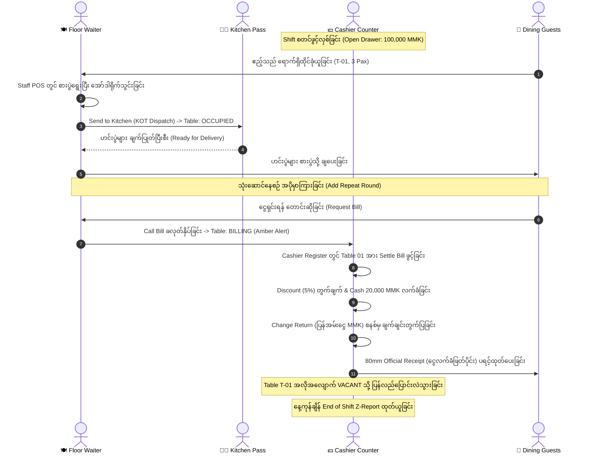

# Real Restaurant POS Core System စနစ် ဗိသုကာနှင့် တည်ဆောက်မှု မှတ်တမ်း (Pillars of Real POS)

## ၁။ နိဒါန်းနှင့် ရည်ရွယ်ချက် (Introduction & Objectives)

စားသောက်ဆိုင် လုပ်ငန်းခွင် လက်တွေ့လောကတွင် အသုံးပြုသော **Real Restaurant POS** တစ်ခုတွင် သာမန်စာရင်းကိုင်စနစ်များနှင့် မတူဘဲ စားသောက်ဆိုင်၏ မြေပြင်လုပ်ငန်းစဉ် (Floor Operations) နှင့် တိုက်ရိုက်ချိတ်ဆက်နေသည့် အဓိကမဏ္ဍိုင် (၃) ရပ် မဖြစ်မနေ လိုအပ်ပါသည်:

1. **Cashier Register & Multi-Tender Checkout System (ငွေရှင်းကောင်တာ စနစ်)**:
   - စားပွဲခုံအလိုက် ကျသင့်ငွေများကို တိုက်ရိုက်ဆွဲယူခြင်း။
   - လျှော့ဈေး (Discount % / Fixed MMK) နှင့် မြန်မာနိုင်ငံအခွန်နှုန်းထား (Commercial Tax 5%) အလိုအလျောက် တွက်ချက်ခြင်း။
   - **ငွေသား (Cash)** ဖြင့် ပေးချေရာတွင် Quick Denominations (+1,000, +5,000, +10,000, +20,000, +50,000, Exact) ဖြင့် အလျင်အမြန် ထည့်သွင်းနိုင်ပြီး **ပြန်အမ်းငွေ (Change Return MMK)** ကို အမှားအယွင်းမရှိ ချက်ချင်း တွက်ချက်ပြသခြင်း။
   - **KBZPay**, **WavePay**, **Card (MPU/Visa)** နှင့် **Split Payment (ငွေသားတစ်ဝက် + ဒစ်ဂျစ်တယ်တစ်ဝက် ခွဲချေခြင်း)** များ လက်ခံနိုင်ခြင်း။
   - ငွေရှင်းပြီးသည်နှင့် စားပွဲခုံကို အလိုအလျောက် `VACANT` အဖြစ် ပြန်လည်ဖွင့်ပေးခြင်းနှင့် တရားဝင် 80mm Thermal Receipt (အခွန်စလစ်) ပရင့်ထုတ်ပေးခြင်း။

2. **Cash Drawer Sessions & Shift Management (အံဆွဲဆိုင်းစီမံခန့်ခွဲမှုနှင့် နေ့ချုပ် Z-Report စနစ်)**:
   - Cashier သည် ဆိုင်းမစတင်မီ စတင်ငွေသား (Opening Float MMK) ဖြင့် Drawer Shift ဖွင့်လှစ်ရခြင်း။
   - ဆိုင်းအတွင်း လိုအပ်သော ငွေအကြွေများ ထပ်ထည့်ခြင်း (Cash In / Paid In) နှင့် အရေးပေါ် ကုန်ကြမ်းဝယ်ယူရန် အံဆွဲထဲမှ ငွေထုတ်ယူခြင်း (Cash Out / Drop) များကို အကြောင်းပြချက်ဖြင့် မှတ်တမ်းတင်ခြင်း။
   - ဆိုင်းပိတ်ချိန် (End of Shift) တွင် အမှန်တကယ် လက်ကျန်ငွေသားကို ရေတွက်စစ်ဆေးပြီး စနစ်မှ မျှော်မှန်းထားသောငွေ (Expected Cash) နှင့် နှိုင်းယှဉ်ကာ **Over / Short (ငွေပို/ငွေလို ကွာဟချက်)** ကို တိကျစွာ တွက်ထုတ်ပေးသော **80mm Shift Z-Report** ထုတ်ပေးခြင်း။

3. **Tableside Waiter POS Terminal (စားပွဲထိုင် ဝန်ထမ်း အော်ဒါယူစနစ်)**:
   - စားပွဲခုံများ၏ အခြေအနေ (🟢 `VACANT`, 🟠 `OCCUPIED`, 🟡 `BILLING`) ကို Real-time မြင်တွေ့ရခြင်း။
   - ဧည့်သည်ဦးရေ (Guest Pax) သတ်မှတ်၍ အော်ဒါဖွင့်လှစ်ခြင်း။
   - Touch Menu အုပ်စုများမှ ဟင်းပွဲများ ရွေးချယ်ခြင်း၊ အထူးမှာကြားချက်များ (Special Cooking Notes - ဥပမာ: အစပ်လျှော့၊ ကြက်သွန်မထည့်၊ ရေခဲများများ) ထည့်သွင်း၍ မီးဖိုချောင်သို့ Kitchen Order Ticket (KOT) ပို့ဆောင်ခြင်း။
   - ထမင်းစားနေစဉ် ထပ်မံမှာယူလိုသော ဟင်းပွဲ/အချိုရည်များကို တူညီသော စားပွဲအော်ဒါထဲသို့ **Repeat Round (အပိုမှာကြားချက်)** အဖြစ် ထပ်ပေါင်းထည့်နိုင်ခြင်း။
   - ဧည့်သည် ထမင်းစားပြီးပါက **"Request Bill"** နှိပ်၍ ငွေရှင်းကောင်တာသို့ ချက်ချင်း အချက်ပေး အသိပေးနိုင်ခြင်း။

---

## ၂။ အဘယ်ကြောင့် ဤသို့ ဒီဇိုင်းရေးဆွဲရသနည်း? (Architecture Decisions & "Why")

### (၁) အဘယ်ကြောင့် Cash Drawer Float နှင့် Z-Report စနစ် ထည့်သွင်းရသနည်း?
- စားသောက်ဆိုင်များတွင် Cashier များသည် နေ့စဉ် ငွေသားမြောက်မြားစွာကို ကိုင်တွယ်ရပါသည်။
- အစပြုငွေ (Opening Float) မသတ်မှတ်ထားပါက ဧည့်သည်အား ပြန်အမ်းငွေပေးရန် ငွေအကြွေ မလုံလောက်ခြင်း၊ နေ့ကုန်ချိန်တွင် အမှန်တကယ် ရောင်းရငွေနှင့် အံဆွဲထဲရှိ ငွေသား ကိုက်ညီမှု ရှိမရှိ မစစ်ဆေးနိုင်ခြင်းတို့ကြောင့် ဝန်ထမ်းအလွဲသုံးစားမှု သို့မဟုတ် ငွေကြေးပျောက်ဆုံးမှုများ ဖြစ်ပွားနိုင်ပါသည်။
- ဤစနစ်တွင် `cash_drawer_sessions` နှင့် `cash_drawer_transactions` ဇယားများဖြင့်:
  $$\text{Expected Cash} = \text{Opening Float} + \text{Cash Sales} + \text{Cash In} - \text{Cash Out}$$
  ဟူသော ညီမျှခြင်းအတိုင်း စနစ်တကျ တွက်ချက်ပြီး နေ့ချုပ် Z-Report တွင် ကွာဟချက် (Variance) ကို တိကျစွာ ရှင်းတမ်းထုတ်ပေးပါသည်။

### (၂) အဘယ်ကြောင့် Waiter Tableside POS တွင် Repeat Rounds (အပိုမှာယူမှု) ပါဝင်ရသနည်း?
- စားသောက်ဆိုင်တွင် ဧည့်သည်များသည် ပထမအကြိမ် အော်ဒါမှာပြီးနောက် ထပ်မံ၍ အအေး၊ အချိုပွဲ သို့မဟုတ် အပိုဟင်းလျာများ မှာယူလေ့ရှိကြပါသည်။
- စနစ်ဟောင်းများတွင် အော်ဒါအသစ်ထပ်ဖွင့်ပါက စားပွဲနံပါတ်重複ခြင်း သို့မဟုတ် ငွေရှင်းရာတွင် စလစ် ၂ စောင်ဖြစ်သွားခြင်းများ ကြုံတွေ့ရပါသည်။
- ဤစနစ်တွင် တူညီသော စားပွဲ၏ Active Order ID ထဲသို့ ဟင်းပွဲအသစ်များကို အလိုအလျောက် ပေါင်းထည့်ပေးပြီး မီးဖိုချောင်သို့ အပိုစလစ် ထုတ်ပေးနိုင်အောင် ရေးဆွဲထားပါသည်။

### (၃) အဘယ်ကြောင့် ငွေရှင်းပြီးသည်နှင့် စားပွဲခုံကို အလိုအလျောက် VACANT သို့ ပြောင်းရသနည်း?
- စားပွဲခုံလွတ်/မလွတ်ကို လူကိုယ်တိုင် လိုက်လံစစ်ဆေးပြီး Update လုပ်နေရပါက ဧည့်သည်အဝင်များချိန်တွင် နေရာချထားမှု ကြန့်ကြာပြီး ဆိုင်၏ စားပွဲလှည့်ပတ်နှုန်း (Table Turnover Rate) ကျဆင်းစေပါသည်။
- Cashier မှ ငွေရှင်းအတည်ပြုလိုက်သည်နှင့် စနစ်သည် DB Transaction ဖြင့် `Order: COMPLETED`, `DiningTable: VACANT` သို့ တစ်ပြိုင်နက် ပြောင်းလဲပေးသဖြင့် Waiter သည် ဧည့်သည်အသစ်အား ချက်ချင်း နေရာချထားနိုင်ပါသည်။

---

## ၃။ အဆင့်ဆင့် အလုပ်လုပ်ဆောင်ပုံ ဗိသုကာ (End-to-End Workflow Diagram)



---

## ၄။ ဒေတာဘေ့စ် ဖွဲ့စည်းပုံ အသစ်များ (Database Schemas)

### (၁) `cash_drawer_sessions` (ဆိုင်းစီမံခန့်ခွဲမှု ဇယား)
```sql
CREATE TABLE cash_drawer_sessions (
    id BIGINT UNSIGNED AUTO_INCREMENT PRIMARY KEY,
    restaurant_id BIGINT UNSIGNED NOT NULL,
    user_id BIGINT UNSIGNED NOT NULL, -- Cashier
    terminal_code VARCHAR(50) DEFAULT 'POS-REG-01',
    opened_at TIMESTAMP DEFAULT CURRENT_TIMESTAMP,
    closed_at TIMESTAMP NULL,
    opening_float BIGINT UNSIGNED DEFAULT 0, -- MMK
    cash_sales BIGINT UNSIGNED DEFAULT 0, -- MMK
    digital_sales BIGINT UNSIGNED DEFAULT 0, -- KBZPay, WavePay, Card
    cash_in BIGINT UNSIGNED DEFAULT 0,
    cash_out BIGINT UNSIGNED DEFAULT 0,
    expected_cash BIGINT UNSIGNED DEFAULT 0,
    closing_actual_cash BIGINT UNSIGNED NULL,
    cash_difference BIGINT NULL, -- Over (+) / Short (-)
    status VARCHAR(20) DEFAULT 'OPEN', -- OPEN, CLOSED
    notes TEXT NULL,
    created_at TIMESTAMP,
    updated_at TIMESTAMP
);
```

### (၂) `cash_drawer_transactions` (အံဆွဲငွေ အဝင်/အထွက် ဇယား)
```sql
CREATE TABLE cash_drawer_transactions (
    id BIGINT UNSIGNED AUTO_INCREMENT PRIMARY KEY,
    cash_drawer_session_id BIGINT UNSIGNED NOT NULL,
    restaurant_id BIGINT UNSIGNED NOT NULL,
    user_id BIGINT UNSIGNED NOT NULL,
    type VARCHAR(20) NOT NULL, -- CASH_IN, CASH_OUT
    amount BIGINT UNSIGNED DEFAULT 0, -- MMK
    reason VARCHAR(255) NOT NULL,
    created_at TIMESTAMP,
    updated_at TIMESTAMP
);
```

---

## ၅။ တင်းကျပ်သော စည်းမျဉ်းများနှင့်အညီ တည်ဆောက်ထားသော ဖိုင်များ (Strict Rules Compliance)

### (၁) Form Requests (Rule #4 - Mandatory Validation)
- [`OpenShiftRequest`](file:///Users/kyawwaiyan/Documents/my-Home-tech/resturant-pos/backendPos/app/Http/Requests/Pos/OpenShiftRequest.php) - ဆိုင်းဖွင့် Float MMK စိစစ်ခြင်း။
- [`CashInOutRequest`](file:///Users/kyawwaiyan/Documents/my-Home-tech/resturant-pos/backendPos/app/Http/Requests/Pos/CashInOutRequest.php) - ငွေသွင်း/ထုတ် ပမာဏနှင့် အကြောင်းပြချက် စိစစ်ခြင်း။
- [`CloseShiftRequest`](file:///Users/kyawwaiyan/Documents/my-Home-tech/resturant-pos/backendPos/app/Http/Requests/Pos/CloseShiftRequest.php) - လက်ကျန်ငွေ ရေတွက်မှု စိစစ်ခြင်း။
- [`SettleOrderRequest`](file:///Users/kyawwaiyan/Documents/my-Home-tech/resturant-pos/backendPos/app/Http/Requests/Pos/SettleOrderRequest.php) - Payment method, Tendered amount, Discounts စိစစ်ခြင်း။
- [`StoreTablesideOrderRequest`](file:///Users/kyawwaiyan/Documents/my-Home-tech/resturant-pos/backendPos/app/Http/Requests/Pos/StoreTablesideOrderRequest.php) - စားပွဲခုံ၊ ဧည့်သည်ဦးရေနှင့် ဟင်းပွဲများ စိစစ်ခြင်း။
- [`AddOrderItemsRequest`](file:///Users/kyawwaiyan/Documents/my-Home-tech/resturant-pos/backendPos/app/Http/Requests/Pos/AddOrderItemsRequest.php) - အပိုမှာယူမည့် ဟင်းပွဲများ စိစစ်ခြင်း။
- [`RequestBillRequest`](file:///Users/kyawwaiyan/Documents/my-Home-tech/resturant-pos/backendPos/app/Http/Requests/Pos/RequestBillRequest.php) - စားပွဲခုံ ငွေရှင်းတောင်းဆိုမှု စိစစ်ခြင်း။

### (၂) API Resources (Rule #4 & Rule #6 - Money & Transformation)
- [`CashDrawerSessionResource`](file:///Users/kyawwaiyan/Documents/my-Home-tech/resturant-pos/backendPos/app/Http/Resources/Pos/CashDrawerSessionResource.php) - Float, Sales, Expected Cash များကို `MMK` ဖြင့် ဖွဲ့စည်းပေးခြင်း။
- [`CashDrawerTransactionResource`](file:///Users/kyawwaiyan/Documents/my-Home-tech/resturant-pos/backendPos/app/Http/Resources/Pos/CashDrawerTransactionResource.php) - ငွေအဝင်/အထွက် မှတ်တမ်းများ။
- [`CashierOrderResource`](file:///Users/kyawwaiyan/Documents/my-Home-tech/resturant-pos/backendPos/app/Http/Resources/Pos/CashierOrderResource.php) - ငွေရှင်းကောင်တာသုံး အော်ဒါအသေးစိတ်နှင့် အခွန်တွက်ချက်မှု။
- [`ReceiptResource`](file:///Users/kyawwaiyan/Documents/my-Home-tech/resturant-pos/backendPos/app/Http/Resources/Pos/ReceiptResource.php) - 80mm စလစ်အတွက် တရားဝင် အခွန်ပြေစာ ဒေတာ။
- [`DiningTablePosResource`](file:///Users/kyawwaiyan/Documents/my-Home-tech/resturant-pos/backendPos/app/Http/Resources/Pos/DiningTablePosResource.php) - စားပွဲခုံ အခြေအနေနှင့် လက်ရှိအော်ဒါ အနှစ်ချုပ်။

### (၃) Controllers & Blade Views (Rule #5 & Rule #6)
- [`CashDrawerController`](file:///Users/kyawwaiyan/Documents/my-Home-tech/resturant-pos/backendPos/app/Http/Controllers/Web/CashDrawerController.php) - Shift ဖွင့်/ပိတ်၊ ငွေအဝင်/အထွက်နှင့် Z-Report။
- [`CashierCheckoutController`](file:///Users/kyawwaiyan/Documents/my-Home-tech/resturant-pos/backendPos/app/Http/Controllers/Web/CashierCheckoutController.php) - စားပွဲကျသင့်ငွေရှင်းတမ်း၊ ပြန်အမ်းငွေတွက်ချက်မှုနှင့် စလစ်ထုတ်ယူခြင်း။
- [`StaffFloorController`](file:///Users/kyawwaiyan/Documents/my-Home-tech/resturant-pos/backendPos/app/Http/Controllers/Web/StaffFloorController.php) - Tableside Order Taking, Repeat Rounds, Bill Calling။
- [`cashier.blade.php`](file:///Users/kyawwaiyan/Documents/my-Home-tech/resturant-pos/backendPos/resources/views/admin/roles/cashier.blade.php) - Dark Obsidian Modern UI ပါဝင်သော ကောင်တာ Register။
- [`staff.blade.php`](file:///Users/kyawwaiyan/Documents/my-Home-tech/resturant-pos/backendPos/resources/views/admin/roles/staff.blade.php) - Touchscreen အသုံးပြုနိုင်သော စားပွဲခုံ ကြမ်းပြင်အော်ဒါယူစနစ်။
- [`print-receipt.blade.php`](file:///Users/kyawwaiyan/Documents/my-Home-tech/resturant-pos/backendPos/resources/views/admin/orders/print-receipt.blade.php) - 80mm တရားဝင် စားသောက်ဆိုင် စလစ်ဖြတ်ပိုင်း။
- [`z-report.blade.php`](file:///Users/kyawwaiyan/Documents/my-Home-tech/resturant-pos/backendPos/resources/views/admin/roles/z-report.blade.php) - 80mm နေ့ချုပ်ငွေရှင်းတမ်း (Reconciliation)။

---

## ၆။ လက်တွေ့ စမ်းသပ်စစ်ဆေးခြင်း လမ်းညွှန် (Testing Guide)

### အဆင့် (၁) - Cashier Shift ဖွင့်လှစ်ခြင်း
1. Browser မှတစ်ဆင့် `http://localhost:8000/cashier/dashboard` သို့ ဝင်ရောက်ပါ။
2. **"Open Cash Drawer Shift"** ခလုတ်ကို နှိပ်ပါ။
3. အစပြုငွေသား (Opening Float) `100,000 MMK` ထည့်သွင်းပြီး အတည်ပြုပါ။ Shift Status သည် `OPEN` ဖြစ်သွားပါမည်။

### အဆင့် (၂) - စားပွဲထိုင် အော်ဒါယူခြင်း (Tableside Waiter Order)
1. Browser တွင် `http://localhost:8000/staff/dashboard` သို့ ဝင်ရောက်ပါ။
2. လွတ်နေသော စားပွဲ (ဥပမာ: `T-01`) ပေါ်ရှိ **"+ Seat Guests & Order"** ကို နှိပ်ပါ။
3. ဧည့်သည်ဦးရေ (ဥပမာ: 3 Pax) ရွေးချယ်ပြီး Menu ထဲမှ ဟင်းပွဲများကို နှိပ်၍ မှာကြားပါ။
4. **"Send Order to Kitchen"** နှိပ်လိုက်သည်နှင့် အော်ဒါသည် မီးဖိုချောင်သို့ ရောက်ရှိသွားပြီး စားပွဲသည် `OCCUPIED` အဖြစ်သို့ ပြောင်းလဲသွားပါမည်။

### အဆင့် (၃) - စားပွဲမှ ငွေရှင်းရန် တောင်းဆိုခြင်း (Request Bill)
1. စားပွဲ `T-01` ပေါ်ရှိ **"Call Bill"** ခလုတ်ကို နှိပ်ပါ။
2. စားပွဲသည် `BILLING` (အဝါရောင် pulsing badge) သို့ ချက်ချင်း ပြောင်းလဲသွားပါမည်။

### အဆင့် (၄) - ကောင်တာမှ ငွေရှင်းပေးခြင်းနှင့် ပြန်အမ်းငွေတွက်ချက်ခြင်း
1. `http://localhost:8000/cashier/dashboard` သို့ ပြန်သွားပါ။
2. Table 01 ပေါ်တွင် **"Settle Bill"** ကို နှိပ်ပါ။
3. ဧည့်သည် ပေးချေသော ငွေသား (ဥပမာ: `30,000 MMK`) ကို ရိုက်ထည့်ပါက ပြန်အမ်းငွေ (Change Return) ကို အလိုအလျောက် တွက်ချက်ပြသပါမည်။
4. **"Complete Settlement & Print Receipt"** ကို နှိပ်လိုက်သည်နှင့် တရားဝင် 80mm Receipt စလစ် ထွက်လာမည်ဖြစ်ပြီး စားပွဲသည် `VACANT` အဖြစ် အလိုအလျောက် လွတ်သွားပါမည်။

### အဆင့် (၅) - နေ့ချုပ် Z-Report ထုတ်ယူခြင်း
1. Cashier Dashboard ပေါ်ရှိ **"End Shift & Z-Report"** ကို နှိပ်ပါ။
2. အံဆွဲထဲတွင် ရေတွက်ရရှိသော ငွေသားပမာဏကို ရိုက်ထည့်ပြီး အတည်ပြုပါ။
3. စနစ်မှ အပို/အလို ကွာဟချက်နှင့်အတူ 80mm Z-Report ကို ထုတ်ပေးပါမည်။
